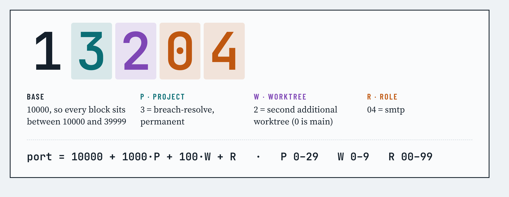
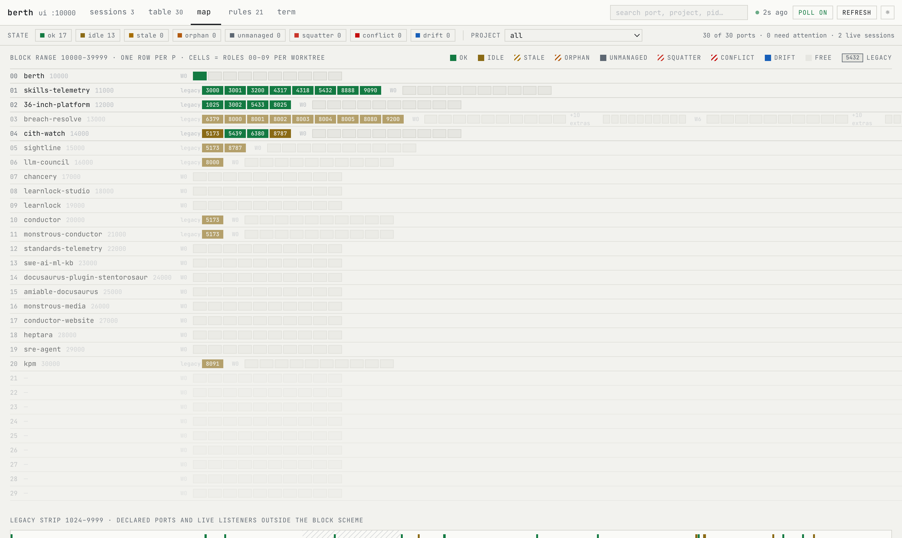

# berth

**Give every project on your machine its own block of ports, then let your agents and your terminal agree on who holds what.**

<picture>
  <source media="(prefers-color-scheme: dark)" srcset="docs/images/port-rule-dark.png">
  
</picture>

When several Claude Code sessions, a couple of git worktrees and a Docker stack all start dev servers on one laptop, ports collide and every session loses track of the port it was given. berth fixes the bookkeeping, not the servers:

- **Every project gets a permanent block of ports**, and the number itself says whose it is. 13204 is project 3, worktree 2, smtp. Nobody has to remember an allocation table.
- **A small ledger records who holds which port**, and a reconciler checks it against what is actually listening, including containers behind Colima or Docker Desktop and servers started by a Claude session.
- **Agents are told their ports when a session starts**; humans get a terminal table, `berth who <port>`, and a local dashboard.
- **It is advisory.** berth never blocks a command and never kills anything on its own. It tells you, and your agents, the truth.

<picture>
  <source media="(prefers-color-scheme: dark)" srcset="docs/images/dashboard-map-dark.png">
  
</picture>

## Install

berth is used from two places, and the setup differs.

**From an agent session (Claude Code).** Install the plugin once per machine; you or the agent can run it:

```bash
claude plugin marketplace add amiable-dev/berth
claude plugin install berth@berth
```

From the next session on, every session gets its project's ports injected at start, `berth` on its PATH (the plugin ships the CLI; no global install needed), the MCP tools (`berth_check`, `berth_who`, `berth_ls`, `berth_claim`, `berth_release`, `berth_env`), and two skills. To bring a repository under berth, ask the agent: *"register this repo in berth"*. The `berth-onboard` skill runs `berth init` if there is no policy yet, `berth project add .`, and wires the checkout (`env`, the Compose override, `launch.json`). Nothing here needs a human at the keyboard except the decisions berth deliberately leaves to you (see "What an agent may do" below).

**From a terminal (humans and scripts).** Install the CLI globally:

```bash
npm install -g @amiable-dev/berth      # Node 20 or newer, zero runtime dependencies
berth init                              # a starting policy in ~/.config/berth/policy.toml
cd ~/projects/my-app && berth project add .   # next free project number, ports found in your configs
berth check                             # what is listening, who holds it, what needs attention
```

`berth project add` is additive and idempotent: it appends one `[projects.<name>]` table, records the ports your repo already hardcodes as `declared`, and names Compose services that aren't one of the ten roles as `extras`. Project numbers are permanent from that moment; `berth project list` shows them. `berth doctor` checks lsof, Docker, the policy and the Claude Code wiring (plugin or manual hooks).

**Who does what**

| Once per machine (human, or the agent on request) | Per repository (the agent, via the skill) | Human decisions |
|---|---|---|
| install the plugin; optionally the global CLI for your own terminal | `berth project add .`, `berth env`, `berth launch-json --write`, claims and releases for its own session | a project's permanent number if you want a specific one, shared stacks, and the human-only commands: `free`, `--force`, `hooks install`, `worktrees prune`, `init --force` |

The manual route for Claude Code (`berth hooks install`, `claude mcp add --scope user berth -- berth mcp`, the rules in [`examples/CLAUDE.ports.md`](examples/CLAUDE.ports.md)) still works and is described under Claude Code integration.

## Day to day

**Starting a session.** With the hooks installed (`berth hooks install`), every Claude Code session starts with its project's block in context and `PORT`, `API_PORT`, `DB_PORT` and the other role ports exported. In a plain shell:

```bash
eval "$(berth env --shell)"        # this checkout's ports as environment variables
```

**Starting a server.** Use the exported port and strict mode, so a busy port fails loudly instead of silently sliding to the next number:

```bash
vite --port "$PORT" --strictPort
uvicorn app:main --port "$API_PORT"
berth claim --role api             # record that this session owns the api port
```

Docker Compose files that hardcode host ports need no edits:

```bash
eval "$(berth env --compose-override)"   # writes an !override file and sets COMPOSE_FILE
docker compose up
```

**Who has 5432?**

```bash
berth who 5432
```

```
5432  ok  (declared)
  live     deploy-postgres-1 · ~/projects/amiable/skills-telemetry/deploy
  how we know
    › docker: container deploy-postgres-1, compose deploy, working_dir ~/projects/amiable/skills-telemetry/deploy
    › lsof: published through ssh pid 503 (Colima)
    › policy: declared by skills-telemetry, breach-resolve, learnlock-studio, standards-telemetry
  advisory none
```

**Is anything wrong?**

```bash
berth check                        # "30 ports · 0 need attention · 2 live sessions", then the attention list
berth ls                           # Project → Worktree → Role table
```

Each port gets one of eight states and, when it needs attention, the one command that fixes it (release a stale lease, adopt a server you started by hand, look at a conflict). `check` always exits 0.

**A scratch server or a new worktree.**

```bash
berth claim --dynamic 1            # a port from the dynamic pool with an 8 h lease
berth release --port 40012         # give it back
```

Worktrees get their own hundred-port slice of the project block the first time `berth env` or `berth claim` runs inside them; `berth worktrees list` shows the slots.

**Watching everything.**

```bash
berth ui                           # http://127.0.0.1:10000
```

Sessions, the grouped table, the range map above, the rules from your policy, and a drawer that explains any port. It polls every five seconds and binds to localhost only.

## The port number is the rule

```
port = 10000 + 1000·P + 100·W + R
```

| Part | Meaning | Range |
|---|---|---|
| **P** | project number, hand-assigned and permanent | 0–29 → blocks 10000–39999 |
| **W** | worktree: 0 is the main checkout, 1–9 additional worktrees | 0–9 |
| **R** | role slot | 00 web · 01 api · 02 db · 03 cache · 04 smtp · 05 mail-ui · 06 docs · 07 worker · 08 otlp-grpc · 09 otlp-http · 10–99 project-named extras |

Nothing common defaults into that range; the few well-known ports that do (11211, 15672, 16686, 27017 …) sit on a lint list and are never handed to a canonical role. Ad-hoc servers get a TTL lease from a dynamic pool (40000–41999), legacy hardcoded ports are registered as `declared` so conflicts are visible before any migration, and a shared observability stack is declared once with an owner so other projects connecting to it is fine.

## What the states mean

| State | Meaning | Advisory |
|---|---|---|
| `ok` | leased and bound by the expected owner, or a shared service | none |
| `idle` | leased or declared, nothing bound, owner alive | shown dimmed |
| `stale` | leased, nothing bound, owner pid gone | `berth release --port N`; never auto-killed |
| `orphan` | lease cwd no longer exists (worktree removed) | release; the tombstone keeps the slot |
| `unmanaged` | bound inside a managed range with no lease | `berth adopt N --owner human` |
| `squatter` | bound inside another project's block by a different project or session | `berth who N`; do not kill |
| `conflict` | lease owner differs from the live holder | `berth who N --json`; the owning session's belief is wrong |
| `drift` | config declares a port outside its allocation, or a shared stack is partially up | `berth scan --write`; never reassigned |

Truth comes from four read-only sources, none of which need sudo: `lsof` for your listeners and their working directories, `netstat` for other users' listeners, `docker ps` compose labels to attribute container ports (the Colima or Docker Desktop proxy process is never treated as the owner), and `ps -E` to read the `CLAUDE_CODE_SESSION_ID` marker from a listener's environment, which attributes a server to the session that started it even when nobody claimed anything. Liveness beats the clock: a lease whose pid is alive and whose port is bound stays `ok` whatever its TTL says.

## Claude Code integration

The plugin bundles everything below and, through the SessionStart hook, puts its own `berth` on the session's PATH. Installed by hand, the pieces are:

- **SessionStart** runs `berth context`: read-only, under 200 ms, always exit 0. It injects the project's block, current leases, shared services and any live conflict touching this project, and appends the role-port exports to `CLAUDE_ENV_FILE`.
- **SessionEnd** runs `berth session-end`: records that the session ended; its leases go `stale` once nothing is bound.
- **Rules** for `~/.claude/CLAUDE.md` are in [`examples/CLAUDE.ports.md`](examples/CLAUDE.ports.md). Strict-port is the rule that makes an advisory registry work.
- **MCP**: `claude mcp add --scope user berth -- berth mcp` exposes `berth_check`, `berth_who`, `berth_ls`, `berth_claim`, `berth_release` and `berth_env` to every session.
- **Desktop preview pane**: `berth launch-json --write` generates `.claude/launch.json` with the allocated ports.
- **Names**: `berth names sync` turns http leases into [portless](https://github.com/vercel-labs/portless) aliases such as `chancery.localhost`; berth allocates, portless only proxies.

Any other agent or script uses the same CLI; `--json` is the boundary on every read command.

**What an agent may do.** Everything self-scoped: learn its ports, claim and release its own leases, adopt a server it started, register the repo it is in, write that repo's `launch.json`. Commands with teeth (`free`, anything with `--force`, `hooks install|uninstall`, `worktrees prune`, `init --force`) are refused inside an agent session; a human runs them from their own shell, or sets `BERTH_ALLOW_DESTRUCTIVE=1` deliberately. The MCP server exposes only the self-scoped tools.

## Commands

```
ls [--project X] [--all] [--state S] [--json]   ports grouped by project → worktree → role
who <port> [--json]                             lease, live holder, evidence, advisory
check [--json] [--no-docker]                    reconcile ledger with reality; exit 0 always
env [--shell|--dotenv|--compose-override|--json] [--worktree N] [--cwd DIR]
claim --role R | --extra NAME | --dynamic N | --port P [--note T] [--force] [--json]
release --port P | --all [--force] [--json]
adopt <port> --owner human|session [--project X] [--role R] [--json]
free <port> [--force] [--json]                  SIGTERM an own-user listener; refuses others'
init [--base N]                                 write a starting policy (no projects)
project add [path] [--name N] [--number P]      register a repo: next free P, declared ports, extras
project list [--json]                           registered projects and their blocks
scan [--write] [--project X] [--json]           ports hardcoded in repo configs vs policy
compact                                         fold per-session claim files into the ledger
context | session-end                           Claude Code hook entry points
hooks install|uninstall|print                   manage ~/.claude/settings.json hooks
launch-json [--write] [--cwd DIR]               .claude/launch.json for the desktop preview pane
names list|sync [--all] [--dry-run] [--json]    portless aliases for http leases
worktrees list|remove|prune [--json]            worktree slots and tombstones
mcp                                             MCP server over stdio
ui [--port N] [--open]                          dashboard on 127.0.0.1 (default 10000)
doctor [--json]                                 environment checks
```

Environment: `BERTH_POLICY`, `BERTH_CONFIG_DIR`, `BERTH_STATE_DIR`, `NO_COLOR`, `BERTH_ALLOW_DESTRUCTIVE`. Exit codes: 0 ok, 1 refused or failed, 2 usage.

## How it stays safe

- No daemon. Reads never lock; each session writes its own claim file; the single lock guards compaction and explicit writes, records the holder's pid start time, and is only broken when that pid is provably gone.
- No shell. Every external command runs through `execFile` with an argument array and a timeout. Only three Claude marker variables are read from process environments; nothing else is retained.
- The dashboard binds 127.0.0.1, serves GET only, never touches the file system, and uses a per-response nonce CSP with `frame-ancestors 'none'`. Cross-site requests to `/api/state` are refused.
- `free` signals only pids you own, never containers or VM proxies, and refuses ports held by another live session unless you force it.
- State lives in `~/.local/state/berth` as 0600 files in a 0700 directory. The package has no runtime dependencies and is published with npm provenance.

See [SECURITY.md](SECURITY.md) for the disclosure policy.

## Design

- [docs/DESIGN.md](docs/DESIGN.md): the council-reviewed design, decisions and rollout.
- [docs/RESEARCH.md](docs/RESEARCH.md): the OSS landscape it was measured against.
- [docs/adr/](docs/adr/): ADR-001 advisory not enforcement · ADR-002 the decodable port scheme · ADR-003 daemonless ledger and lock-free claims · ADR-004 truth sources and attribution · ADR-005 Node 20 single bundle · ADR-006 self-configuring CLI · ADR-007 plugin, skills and MCP · ADR-008 agent guardrails.
- [design_handoff_berth_ui/](design_handoff_berth_ui/): the dashboard design pack and prototype the UI was built to.

## Contributing

Issues and pull requests are welcome; see [CONTRIBUTING.md](CONTRIBUTING.md), the [code of conduct](CODE_OF_CONDUCT.md) and [SUPPORT.md](SUPPORT.md). `npm run check` runs lint, typecheck, tests and the build.

## Licence

[MIT](LICENSE) © 2026 Amiable Dev
