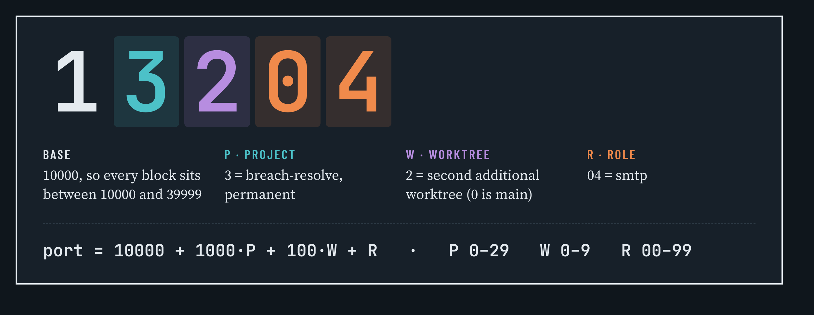
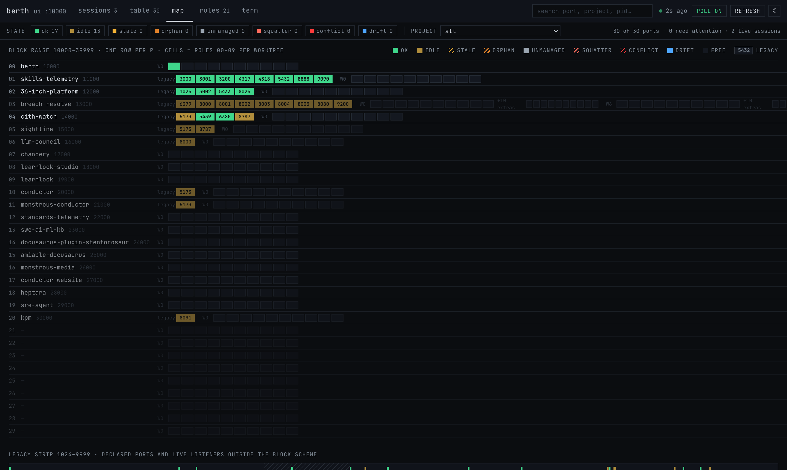

<div class="vp-doc" style="max-width: 1152px; margin: 32px auto 0; padding: 0 24px;">




## Sixty seconds

```bash
npm install -g @amiable-dev/berth
berth init                                   # a starting policy in ~/.config/berth/policy.toml
cd ~/projects/my-app && berth project add .  # permanent project number, ports found in your configs
eval "$(berth env --shell)"                  # PORT, API_PORT, DB_PORT … for this checkout
berth check                                  # what is listening, who holds it, what needs attention
```

With Claude Code, install the plugin instead and let the agent register its own repository:

```bash
claude plugin marketplace add amiable-dev/berth
claude plugin install berth@berth
```




</div>
